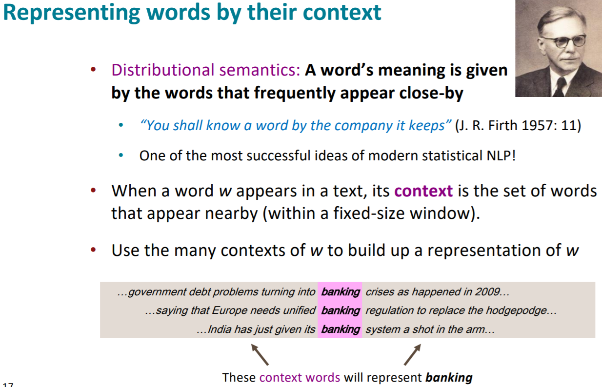
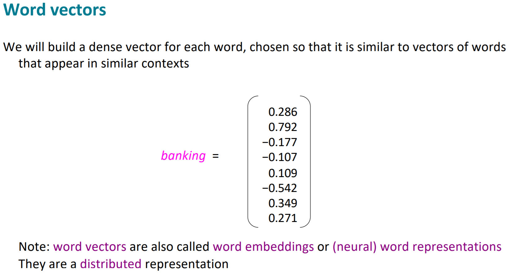
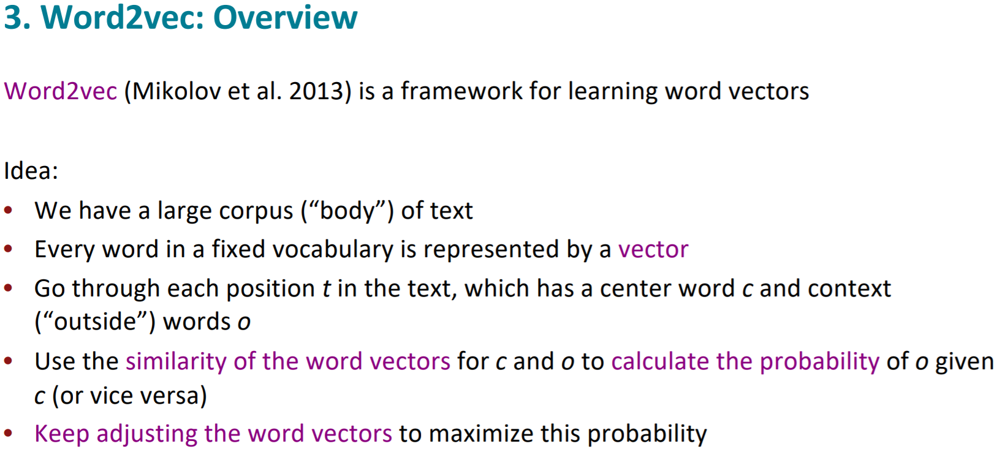
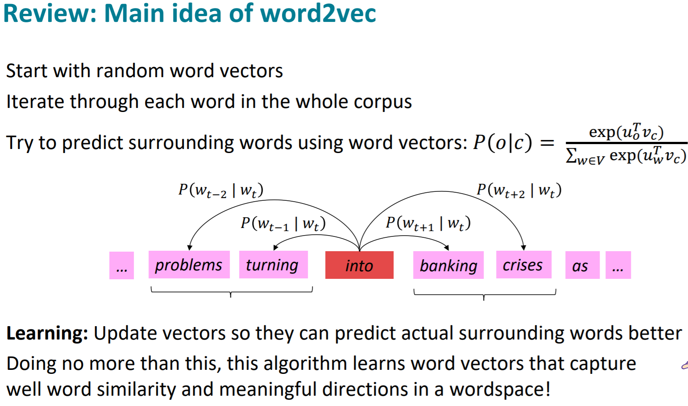
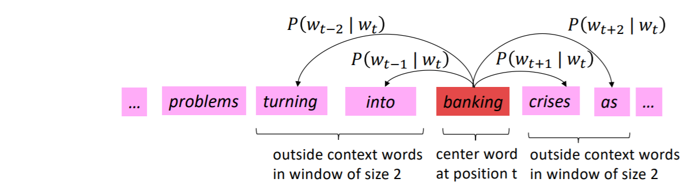

# Natural Language Processing

## Word2Vec
> [Reference](https://gist.github.com/aparrish/2f562e3737544cf29aaf1af30362f469) \
> **Word Embeddings:** vector representation of a word.

### Distributed Representation
> Word representations are limited by their inability to represent idiomatic phrases that are not compositions of the individual words. Distributed Representation help learning algorithms to achieve better
performance in natural language processing tasks by grouping similar words

## Model Architectures

Models used for estimating _continuous_ representation of words
- **Latent Semantic Analysis**
- **Latent Dirichlet Allocation**

Models used for estimating _distributed_ representation of words
- **Continuous Bag-of-Words Model:** Predicts the **_target_** word from the _context_ words
  + _better for frequent words_
- **Continuous Skip-gram Model:** Predicts the _context_ words from the **_target_** word
  + _better for rare words_
- **Feedforward Neural Net Language Model (NNLM)**
- **Recurrent Neural Net Language Model (RNNLM)**
