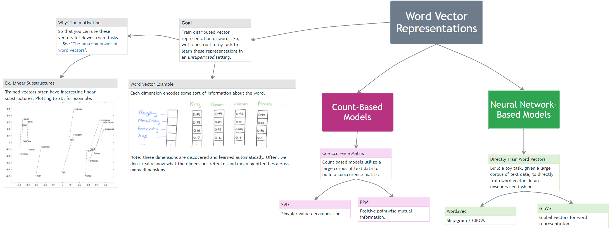
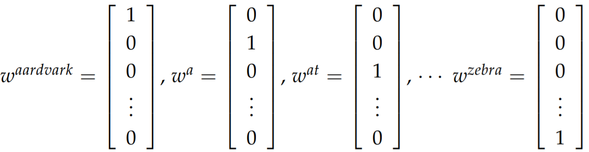
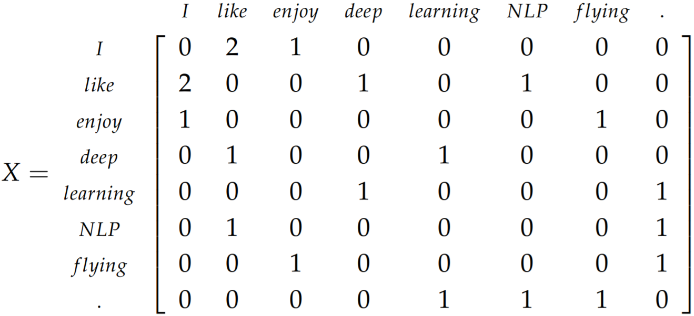
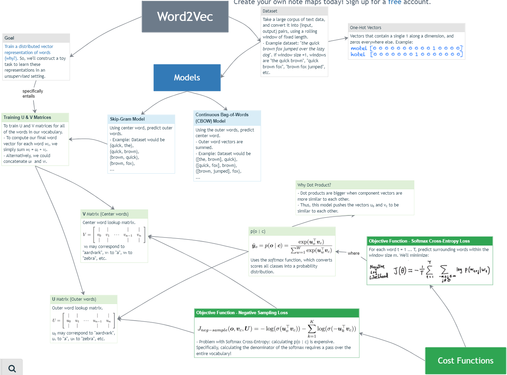
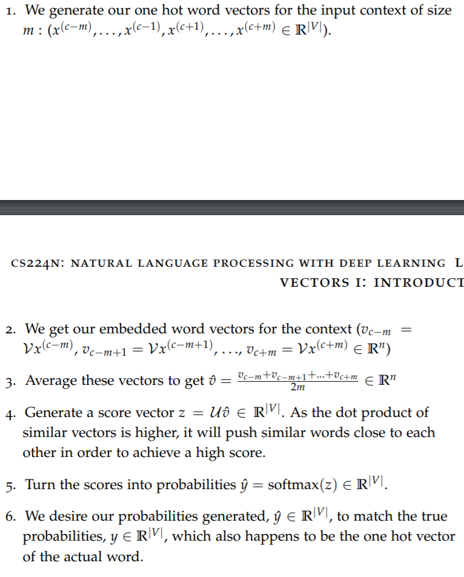
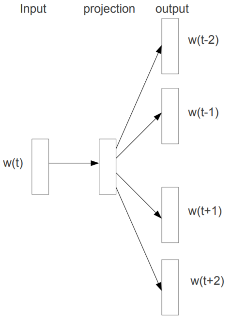
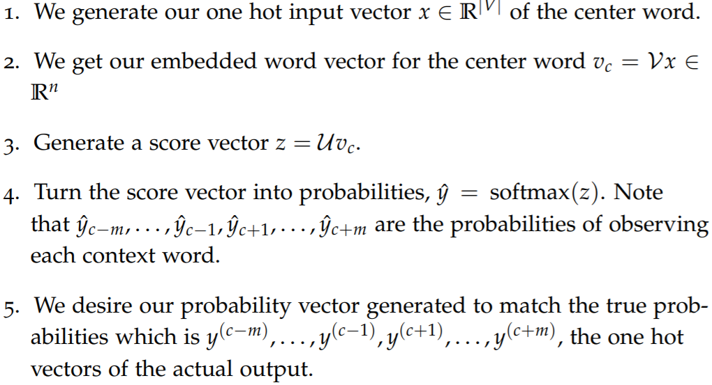
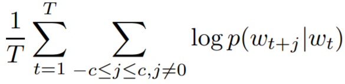
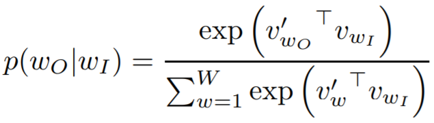

# Natural Language Processing

## SVD Based Methods
> _loop over dataset and accumulate word co-occurrence counts in some form of a matrix X, then preform SVD on X to get USV. Use the rows of U as the word embeddings for all words in dictionary

**_Word-Document Matrix:_** makes the assumption that words that are related will often appear in the same documents.

##

## Word Embeddings
> vector representation of a word to quantify the semantics

## Word Vectors

> _with word vectors, we can quite easily encode this ability in the vectors
themselves (using distance measures such as Jaccard, Cosine, Euclidean, etc)._ \
> This is paramount for a number of reasons but the most intuitive reason is that perhaps there actually exists some N-dimensional space (such that N  13 million) that is sufficient to encode all semantics of
our language. Each dimension would encode some meaning that we transfer using speech. For instance, semantic dimensions might indicate tense (past vs. present vs. future), count (singular vs. plural),
and gender (masculine vs. feminine).

**_One-Hot Vectors:_**

**_SVD & Co-Occurrence_**
- **Co-Occurrence Matrix:** count the number of times each word appears inside a window of a particular size around the word of interest. We calculate this count for all the words in corpus
  
- **Apply SVD:**
- **Potential Problems**
  + _The dimensions of the matrix change very often (new words are added very frequently and corpus changes in size)._
  + _The matrix is extremely sparse since most words do not co-occur._
  + _The matrix is very high dimensional in general_

**_Word2Vec_**

## Word2Vec

> Reference
> - [github](https://gist.github.com/aparrish/2f562e3737544cf29aaf1af30362f469) \
> - [word2vec Parameter Learning Explained](https://arxiv.org/pdf/1411.2738.pdf) \

> _design a model whose parameters are the word vectors. Then, train the model on a certain objective. At every iteration we run our model, evaluate the errors, and follow an update rule that has some notion of penalizing the model parameters that caused the error. Thus, we learn our word vectors._ \

### Algorithms

#### Continuous Bag-of-Words
> Predicts the **_target_** word from the _context_ words. _better for frequent words_

#### Continuous Skip-Grams
> _Predicts the _distribution of context_ words from the **_target_** word. _(better for rare words)_

- **_Training Objective:_**  _find word representations that are useful for predicting the surrounding words in a sentence or a document_

  

- **_Hierarchical Softmax:_**

  

### Training Methods
- **Negative Sampling:** defines an objective by sampling negative examples.
- **Hierarchical Softmax:** x defines an objective using an efficient
tree structure to compute probabilities for all the vocabulary.

> Limitation:  indifference to word order and their inability to represent idiomatic phrases. For example, the meanings of “Canada” and “Air” cannot be easily combined to obtain “Air Canada”

### Distributed Representation
> Word representations are limited by their inability to represent idiomatic phrases that are not compositions of the individual words. Distributed Representation help learning algorithms to achieve better
performance in natural language processing tasks by grouping similar words

## Model Architectures

Models used for estimating _continuous_ representation of words
- **Latent Semantic Analysis**
- **Latent Dirichlet Allocation**

Models used for estimating _distributed_ representation of words
- **Continuous Bag-of-Words Model:** Predicts the **_target_** word from the _context_ words
  + _better for frequent words_
- **Continuous Skip-gram Model:** Predicts the _distribution of context_ words from the **_target_** word
  + _better for rare words_
- **Feedforward Neural Net Language Model (NNLM)**
- **Recurrent Neural Net Language Model (RNNLM)**
