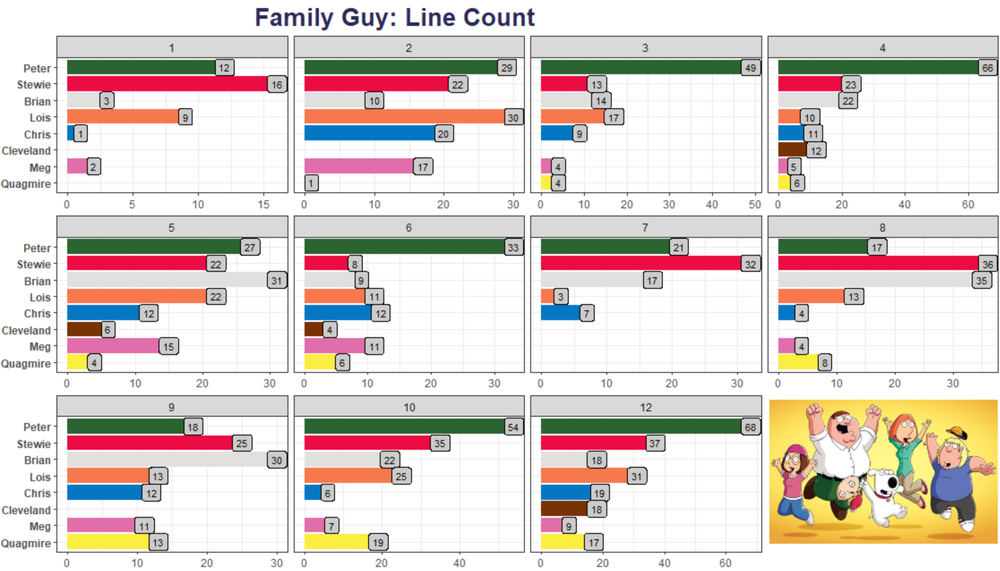

# Family Guy Project Overview

# Reference
[Family Guy Color Chart] (https://www.schemecolor.com/?s=Family+Guy)

### Table of Contents
- [Summary]()
- [Exploratory Data Analysis]()
- [Modeling]()
- [Validation Results]()
- [Test Results]()
- [Conclusion]()

---

### Code Used

Package | version
--- | ---
tidyverse | 1.3.1
forcats | 0.5.0
RColorBrewer | 1.1-2
ggpubr | 0.4.0
tidytext | 0.3.1

### Business Requirement
1.
2.

### Data Collection
> This Dataset consist of lines characters said for Season 1-10 & 12

**(raw)**

Feature | Datatype | Description
--- | --- | ---
character | chr | name of the of the person in the series
dialog | chr | line character says in the series
seasons | chr | season where character said their lines

**Feature Engineering & Cleaning**

Feature | Datatype | Description
--- | --- | ---
index | chr | added an index to keep track of what characters said in what season
season | int | changed "seasons" to "season", and also removed the season from the data and just kept the number then changed it to a factor.
character | int | removed "Maids and Butlers M&B" from the Analysis

## Summary

---

# Exploratory Data Analysis

## Count: Lines
Season | n | | Character | n
--- | --- | --- | --- | ---
1 | 43 | | Peter | 394
2 | 129 | | Stewie | 269
3 | 110 | | Brian | 211
4 | 155 | | Lois | 184
5 | 139 | | Chris | 113
6 | 94 | | Meg | 85
7 | 80 | | Quagmire | 78
8 | 117 | | Cleveland | 40
9 | 122
10 | 168
12 | 217

## Count: Character by Season

## Term Frequency
---

# Sentiment Analysis

---

# Topic Modeling

---

# Conclusion
