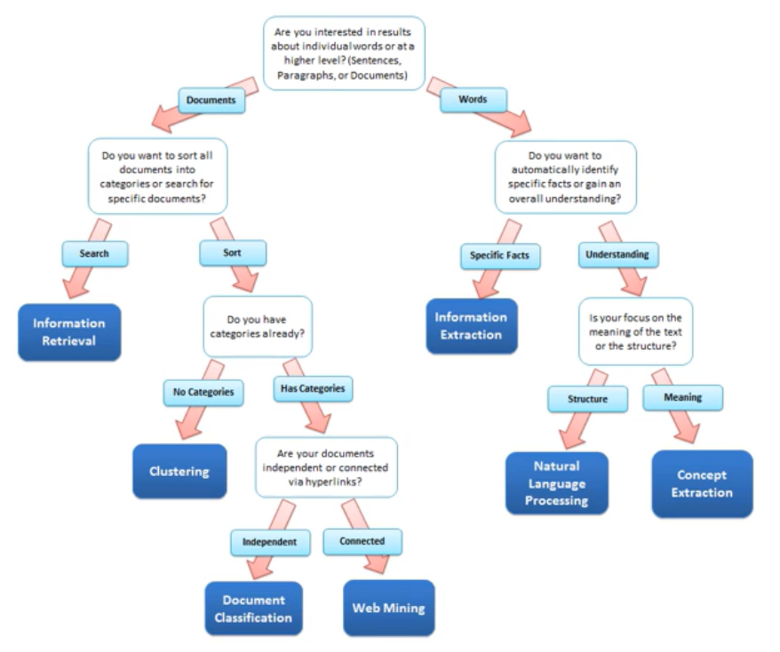
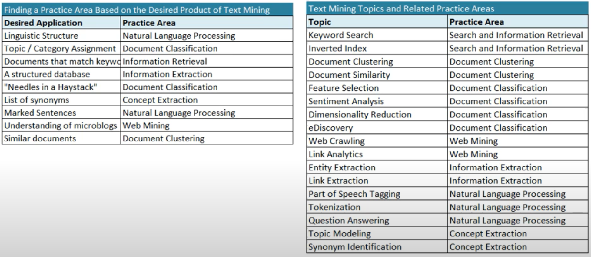

  
  

# Tasks

## Easy
- **SPELL CHECKING**
- **KEYWORD SEARCH**
- **FINDING SYNONYMS**

# Medium
- **PARSING INFORMATION (websites, documents)**

# Hard
- **MACHINE TRANSLATION (Chinese to English)**
- **SEMANTIC ANALYSIS (what is the meaning of a query statement)**
- **COREFERENCE (What does "he" or "it" refer to given a document)**
- **QUESTION ANSWERING**

# Natural Language Understanding
> [Reference](https://www.youtube.com/playlist?list=PLoROMvodv4rObpMCir6rNNUlFAn56Js20)

- [WORD VECTORS](https://github.com/Gmabatah93/TextAnalysis#word-vectors)
  + [Matrix Designs](https://github.com/Gmabatah93/TextAnalysis#matrix-designs)
  + [Co-occurence](https://github.com/Gmabatah93/TextAnalysis#co-occurence)
  + [Vector Comparison](https://github.com/Gmabatah93/TextAnalysis#vector-comparison)
  + [Reweighting](https://github.com/Gmabatah93/TextAnalysis#reweighting)
  + [Subword Information](https://github.com/Gmabatah93/TextAnalysis#subword-information)
  + [Dimensionality Reduction](https://github.com/Gmabatah93/TextAnalysis#dimensionality-reduction)
  + [Retrofitting](hhttps://github.com/Gmabatah93/TextAnalysis#relation-extractionttps://github.com/Gmabatah93/TextAnalysis#retrofitting)
- [SENTIMENT ANALYSIS](https://github.com/Gmabatah93/TextAnalysis#sentiment-analysis)
  + [Text Preprocessing](https://github.com/Gmabatah93/TextAnalysis#text-preprocessing)
  + [Stanford Sentiment Treebank](https://github.com/Gmabatah93/TextAnalysis#stanford-sentiment-treebank)
  + [Hyperparameter & Classifier Comparison](https://github.com/Gmabatah93/TextAnalysis#hyperparameters--classifier-comparison)
  + [Feature Representation](https://github.com/Gmabatah93/TextAnalysis#feature-representation)
  + [Neural Networks](https://github.com/Gmabatah93/TextAnalysis#neural-networks)
- [RELATION EXTRACTION](https://github.com/Gmabatah93/TextAnalysis#relation-extraction)
  + [Tasks](https://github.com/Gmabatah93/TextAnalysis#tasks)
  + [Pipeline](https://github.com/Gmabatah93/TextAnalysis#pipeline)
  + [Enhancements](https://github.com/Gmabatah93/TextAnalysis#enhancements)

# Natural Language Preprocessing
