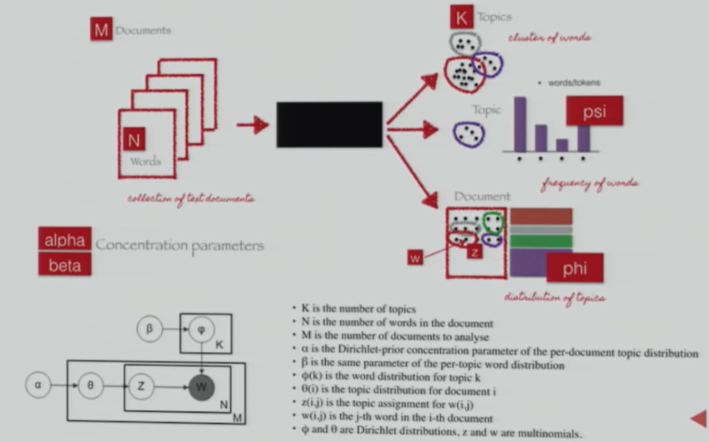
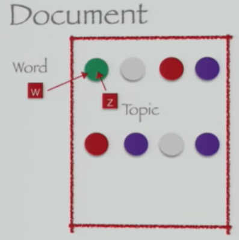
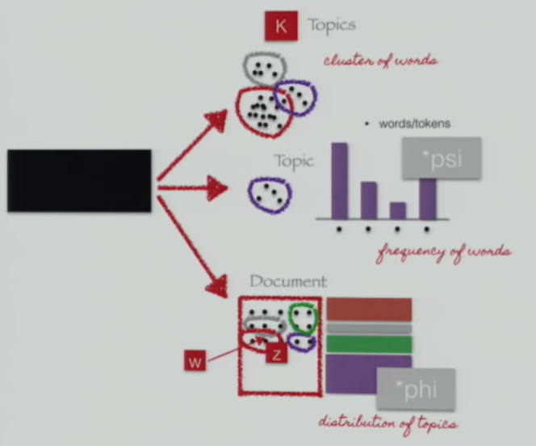
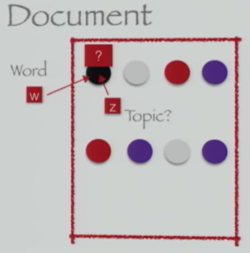
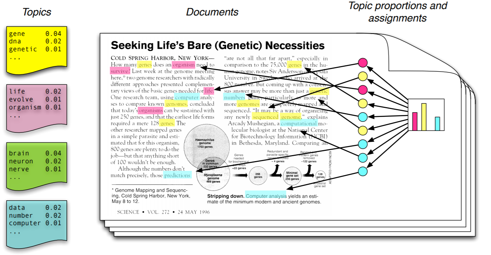
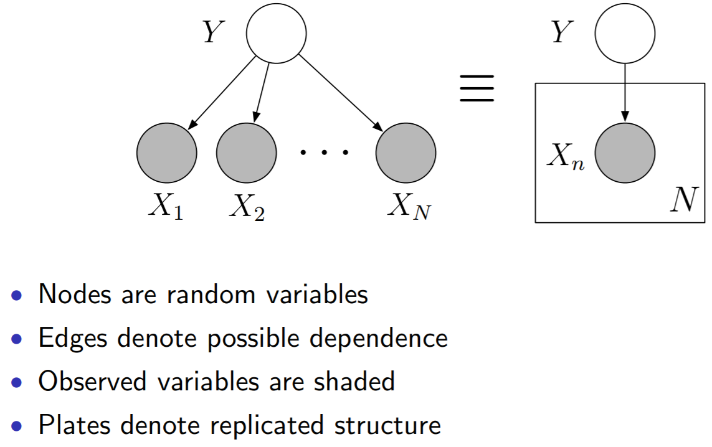
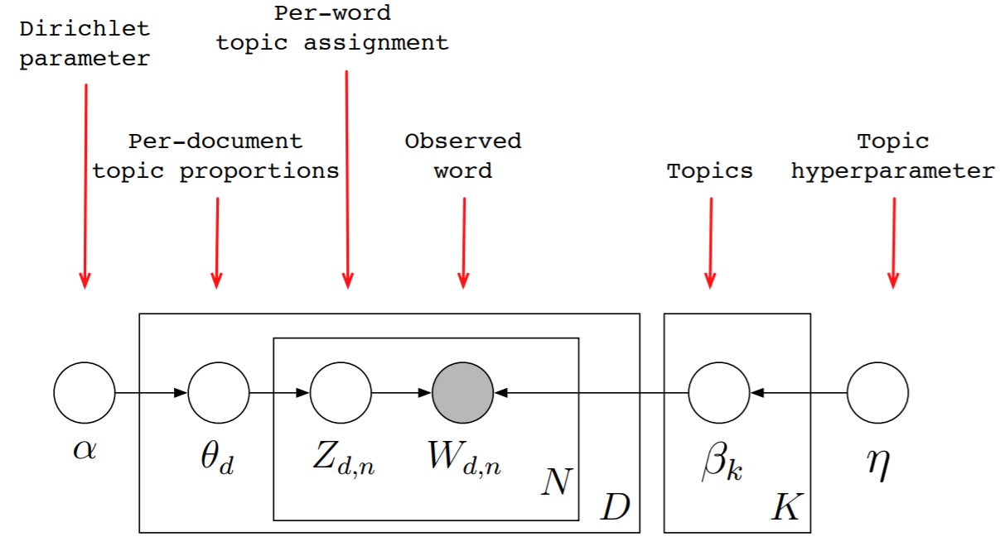

# Regular Expressions

# Text Preprocessing
> **Corpus:** collection of text documents. _[ Corpus / Documents / Paragraphs / Sentences / Tokens ]_.\
**Tokens:** smaller units of text. _[ words / phrases / ngrams]_.\
**Ngrams:** combination of N words

## TOKENIZATION

**White Space Tokenizer _Bag of Words_**
- Sentence: "I went to NY to play football"
- Tokens: "I", "went", "to", "NY", "to", "play", "football"

**Regular Expression Tokenizer**

**Normalization**
> **Morpheme:** base form of a word.
> **Normalization:** process of converting a token into its base form

## STEMMING

_may generate non-meaningful terms_

## LEMMATIZATION

_makes use of vocabulary, word structure, part of speech tagging and grammer relations_

## Part of Speech Tagging
> Defines the syntactic context and role of words in the Sentence. _[ Nouns | Verbs | Adjectives | Adverbs ]_

## Term - Frequency Inverse-Document-Frequency

# Latent Dirichlet Allocation: Explanation 1

1. Initialize parameters

2. Initialize topic assignments randomly

3. Iterate for each word in each document:
  - Resample topic for word, given all other words and their current topic assignments

4. Get results
5. Evaluate Model

# Latent Dirichlet Allocation: Explanation 2

## Generative Model
> 1. Choose a distribution _(Dirichlet)_ over topics
> 2. For each word draw a colored _"coin"_ from the distribution
> 3. Look the distribution _(over terms associated with that coin)_ and draw the word from that distribution
> 4. Repeat for each document

- Each **Topic** is a distribution over terms in the _fixed_ vocabulary
- Different **Topics** has different words with different probabilities

## Graphical Model

- Topics:
  + Each **topic** is a distribution _(Dirichlet)_ over terms

- Topic Assignment 'colored coin"
  + there's a z "colored coin" for every word.

## Dirichlet Distribution

- The parameter **a** controls the mean shape and sparsity of Thetha  

# Latent Dirichlet Allocation: Explanation 3

## Dirichlet Distribution

**Document-Topics:** associates documents with their corresponding topics

**Topic-Words:** associates topics with their corresponding words

## Gibbs Sampling

**Properties**
1. Documents are as monochromatic as possible
2. Words are as monochromatic as possible 
