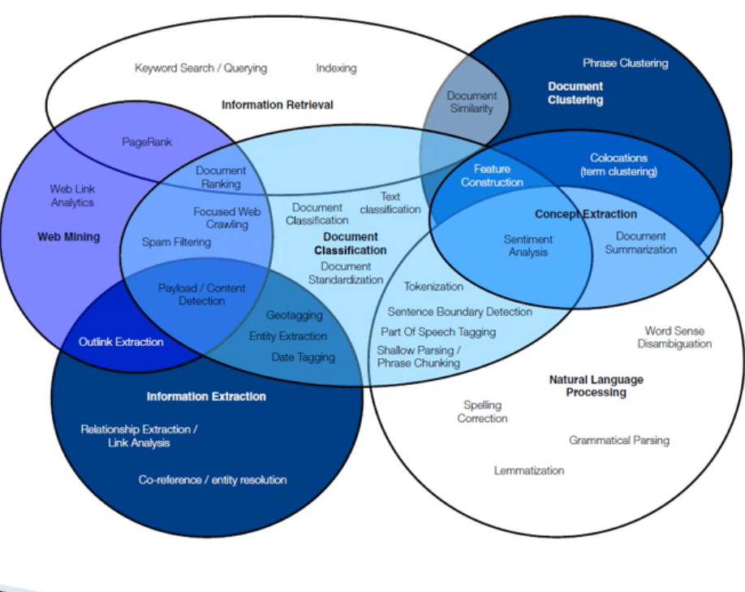

# Natural Language Understanding

## Word Vectors
> Turney & Pantel: "If units of text have similar vectors in a text frequency matrix, then they tend to have similar meanings"

### Matrix Designs

#### Word x Word

#### Word x Document

#### Word x Discourse Context

### Co-occurence

### Vector Comparison

  - used most often because most NLP problems we care about how words are alike

### Reweighting

### Subword Information

### Dimensionality Reduction

### Retrofitting

## Sentiment Analysis

# Regular Expressions

# Pipeline

# Text Preprocessing
> **Corpus:** collection of text documents. _[ Corpus / Documents / Paragraphs / Sentences / Tokens ]_.\
**Tokens:** smaller units of text. _[ words / phrases / ngrams]_.\
**Ngrams:** combination of N words

## TOKENIZATION

**White Space Tokenizer _Bag of Words_**
- Sentence: "I went to NY to play football"
- Tokens: "I", "went", "to", "NY", "to", "play", "football"

**Regular Expression Tokenizer**

**Normalization**
> **Morpheme:** base form of a word.
> **Normalization:** process of converting a token into its base form

## STEMMING

_may generate non-meaningful terms_

## LEMMATIZATION

_makes use of vocabulary, word structure, part of speech tagging and grammer relations_

## Part of Speech Tagging
> Defines the syntactic context and role of words in the Sentence. _[ Nouns | Verbs | Adjectives | Adverbs ]_

## Term - Frequency Inverse-Document-Frequency

# Latent Dirichlet Allocation

## Dirichlet Distribution

**Document-Topics:** associates documents with their corresponding topics

**Topic-Words:** associates topics with their corresponding words

## Gibbs Sampling

**Properties**
1. Documents are as monochromatic as possible
2. Words are as monochromatic as possible

## Determining the number of k
- **Topic Coherence:** examine the words in topics, decide if they make sense
- **Log-Likelihood:** how plausible model parameters are given the data
- **Perplexity:** a measure of model "surprise" at the data
